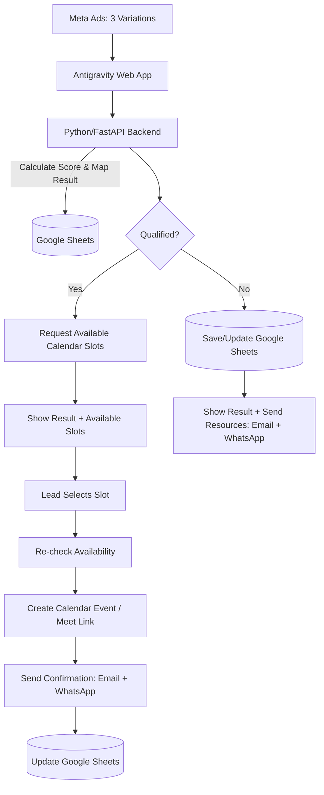

# Guitar Lead Funnel — Architecture Plan

## Goal
Build a simple, mostly-free MVP that:
1. Collects assessment responses from a web app via three distinct ad-driven entry points.
2. Calculates an authoritative lead score from fixed MCQ rules.
3. Maps answers to 1 of 12 personalized result archetypes without using an LLM.
4. Qualifies leads based on their score.
5. Offers qualified leads only genuinely available counselling slots.
6. Sends customized resources to unqualified leads.
7. Records the whole journey, including the ad source and result, in Google Sheets.

## Final MVP Stack

| Component | Technology |
| :--- | :--- |
| **Frontend** | Antigravity |
| **Backend/API** | Python + FastAPI |
| **Data/CRM** | Google Sheets |
| **Scheduling** | Google Calendar API |
| **Meeting** | Google Meet |
| **Email** | Gmail API |
| **WhatsApp** | WhatsApp Business API |
| **Automation** | Python |
| **LLM** | None |
| **Version Control** | GitHub |

## High-Level Flow

## Backend Responsibilities

The Python backend is the source of business logic.

### Initial API:
- `POST /lead`
  - Validate submission (including identifying which of the 3 ad questionnaires was used).
  - Calculate authoritative score (see [`scoringLogic.md`](file:///c:/Guitar%20Lead%20Funnel/scoringLogic.md)).
  - Determine qualification based on score threshold.
  - Generate the personalized result archetype mapping (see [`ResultLogic.md`](file:///c:/Guitar%20Lead%20Funnel/ResultLogic.md)).
  - Save lead to Google Sheets.
  - Return result mapping, score, and qualification status to frontend.

### Later APIs:
- `GET /available-slots`
  - Read counsellor Calendar availability.
  - Return only bookable slots.
- `POST /book`
  - Re-check slot availability.
  - Create Calendar event.
  - Generate/use Google Meet link.
  - Update lead in Google Sheets.
  - Trigger confirmation messages.

## Scoring & Result Generation

The frontend handles the UX of the questionnaire (see [`questionnaire.md`](file:///c:/Guitar%20Lead%20Funnel/questionnaire.md)), but **Python calculates the score and result mapping**. The Python result is authoritative.

- **Scoring:** MCQ answers are mapped to fixed points. Total score determines the qualification threshold.
- **Result Mapping:** Specific high-signal answers (e.g., current level + music preference) map the user to one of 12 distinct result archetypes (see [`results.md`](file:///c:/Guitar%20Lead%20Funnel/results.md)).
- *No LLM is involved in either process.*

## Google Sheets

Google Sheets is the MVP CRM/data store, not the automation engine.

### Suggested Fields

| Field | Description |
| :--- | :--- |
| `lead_id` | Unique identifier for the lead |
| `created_at` | Timestamp of lead creation |
| `campaign_source` | Which Meta Ad / Questionnaire variation was used (Ad 1, 2, or 3) |
| `name` | Lead's name |
| `email` | Lead's email address |
| `phone` | Lead's phone number |
| `assessment_answers` | JSON or string of MCQ responses |
| `frontend_score` | Score calculated on the client side (if any) |
| `verified_score` | Authoritative score calculated by backend |
| `result_archetype` | Which of the 12 results the lead received |
| `qualification` | Qualified / Unqualified status |
| `preferred_timing` | Preferred time for counselling (if asked) |
| `booking_status` | Status of the Calendar booking |
| `meeting_date` | Date and time of the booked meeting |
| `meeting_link` | Google Meet URL |
| `resource_status` | Status of sending resources (for unqualified) |
| `email_status` | Status of confirmation/resource email |
| `whatsapp_status` | Status of confirmation/resource WhatsApp message |

## Deployment Strategy

**Development:**
- Frontend and FastAPI run locally on the developer machine.

**MVP Deployment:**
- Frontend can be deployed to a free/static hosting option.
- FastAPI can be deployed as a serverless Python function or container service.
- **Google Cloud Run** is a strong long-term option because it scales to zero and has an always-free monthly request/compute allowance, subject to Google Cloud billing/account requirements and current quotas.
- **Vercel** also supports Python/FastAPI Functions and automatically scales functions, making it convenient if the frontend is already on Vercel.

**Recommended Direction:**
1. Start locally.
2. Deploy the first working FastAPI version.
3. Use a low/zero-cost deployment tier for MVP traffic.
4. Move to Cloud Run when we want a more conventional scalable Python service.
5. Keep the application stateless so scaling is easy.

## Scalability Principle

> [!IMPORTANT]
> **Do not store important application state on the server filesystem.**
> Keep state in Google Sheets initially and use external APIs for Calendar/email/WhatsApp.

Later, when Google Sheets becomes a bottleneck, replace it with PostgreSQL/Supabase without redesigning the frontend flow.

## Security Principles

> [!WARNING]
> - Never expose Google/WhatsApp/API secrets in the frontend.
> - Store secrets as deployment environment variables.

- Validate all frontend input in Python.
- Recalculate score and result mapping on the backend.
- Re-check Calendar availability immediately before booking.
- Use unique lead IDs and external event IDs to avoid duplicate processing.
- Add authentication before building any private/admin dashboard.

## Build Order

1. FastAPI skeleton
2. `POST /lead` (incorporating scoring and result mapping logic)
3. Google Sheets integration
4. Frontend ➔ backend connection (support for 3 ad variants)
5. Calendar availability
6. Booking
7. Email
8. WhatsApp
9. Deployment
10. Testing, logging and error handling
11. Analytics/admin features

## Key Architecture Decision

> [!NOTE]
> Use **Python/FastAPI** as the central orchestration layer.

- The **frontend** handles user experience for the 3 distinct questionnaires.
- **Python** handles business rules, scoring, result mappings, and integrations.
- **Google Sheets** stores MVP lead data including the assigned result archetype.
- **Google Calendar** handles availability and meetings.
- **Gmail/WhatsApp** handle communications.
- *No LLM is required.*
